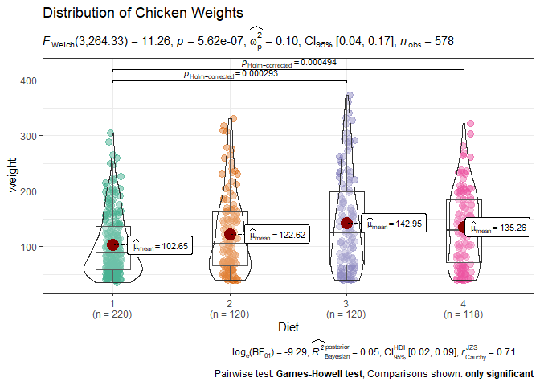

This is an internal collection of useful R-packages I found over the time and often have to Google again, if I want to use them.

## Correlations      


The [`correlation`](https://github.com/easystats/correlation) package provides an easy to use way to calculate and print correlation analysis for different types of correlations ()


```r
library(correlation)

results <- correlation(mtcars %>% select(mpg,hp,cyl))
results
```

```
## # Correlation Matrix (pearson-method)
## 
## Parameter1 | Parameter2 |     r |         95% CI | t(30) |         p
## --------------------------------------------------------------------
## mpg        |         hp | -0.78 | [-0.89, -0.59] | -6.74 | < .001***
## mpg        |        cyl | -0.85 | [-0.93, -0.72] | -8.92 | < .001***
## hp         |        cyl |  0.83 | [ 0.68,  0.92] |  8.23 | < .001***
## 
## p-value adjustment method: Holm (1979)
## Observations: 32
```

```r
summary(results)
```

```
## # Correlation Matrix (pearson-method)
## 
## Parameter |      cyl |       hp
## -------------------------------
## mpg       | -0.85*** | -0.78***
## hp        |  0.83*** |         
## 
## p-value adjustment method: Holm (1979)
```


## Model outputs     

The [`parameters`](https://github.com/easystats/parameters)  package provides utilities for processing the parameters of various statistical models:


```r
library(parameters)
library(lme4)


m <- lmer(weight ~ Diet + (1 + Time | Chick), data = ChickWeight)

model_parameters(m, effects = "all")
```

```
## # Fixed Effects
## 
## Parameter   | Coefficient |   SE |         95% CI | t(570) |      p
## -------------------------------------------------------------------
## (Intercept) |       54.92 | 1.39 | [52.20, 57.65] |  39.53 | < .001
## Diet [2]    |        2.85 | 2.36 | [-1.78,  7.49] |   1.21 | 0.227 
## Diet [3]    |        2.00 | 2.36 | [-2.64,  6.63] |   0.84 | 0.398 
## Diet [4]    |        9.27 | 2.37 | [ 4.63, 13.91] |   3.92 | < .001
## 
## # Random Effects
## 
## Parameter             | Coefficient
## -----------------------------------
## SD (Intercept: Chick) |       31.02
## SD (Time: Chick)      |        9.20
## Cor (Intercept~Chick) |       -1.00
## SD (Residual)         |        3.58
```

## Model performance 


The [`performance`](https://github.com/easystats/performance)  package provides utilities for computing and extracting indices of model quality and goodness of fit (e.g., $R^2$, RMSE, ICC, AIC, BIC) for different types of models (`lm`, `glm`, `lmer`):


```r
library(performance)
library(lme4)

m1 <- lmer(weight ~ 1 + (1 + Time | Chick), data = ChickWeight)
model_performance(m1)
```

```
## # Indices of model performance
## 
## AIC      |      BIC | R2 (cond.) | R2 (marg.) |   ICC |   RMSE |  Sigma
## -----------------------------------------------------------------------
## 4927.250 | 4949.048 |      0.837 |      0.000 | 0.837 | 12.044 | 12.788
```

```r
m2 <- lmer(weight ~ Diet + (1 + Time | Chick), data = ChickWeight)


compare_performance(m1, m2, rank = TRUE)
```

```
## # Comparison of Model Performance Indices
## 
## Name |   Model |      AIC |      BIC | R2 (cond.) | R2 (marg.) |   ICC |   RMSE |  Sigma | Performance-Score
## ------------------------------------------------------------------------------------------------------------
## m2   | lmerMod | 4909.447 | 4944.324 |      0.856 |      0.010 | 0.855 | 12.089 | 12.785 |            85.71%
## m1   | lmerMod | 4927.250 | 4949.048 |      0.837 |      0.000 | 0.837 | 12.044 | 12.788 |            14.29%
```

```r
test_bf(m1, m2)
```

```
## Bayes Factors for Model Comparison
## 
##      Model                        BF
## [m2] Diet + (1 + Time | Chick) 10.61
## 
## * Against Denominator: [m1] 1 + (1 + Time | Chick)
## *   Bayes Factor Type: BIC approximation
```


## MCMC handling     

The [`MCMCvis`](https://cran.r-project.org/web/packages/MCMCvis/vignettes/MCMCvis.html) package is an R package used to visualize, manipulate, and summarize MCMC output:


```r
library(MCMCvis)

MCMCsummary(MCMC_data, params = "alpha", round = 2)
```

```
##            mean   sd   2.5%    50% 97.5% Rhat n.eff
## alpha[1]  -9.78 2.09 -13.87  -9.75 -5.72    1 10406
## alpha[2] -10.95 4.09 -18.99 -11.00 -2.93    1 10807
## alpha[3] -12.81 5.35 -23.33 -12.83 -2.51    1 10500
## alpha[4] -13.16 4.55 -22.00 -13.13 -4.27    1 11160
## alpha[5] -11.68 8.89 -28.86 -11.73  6.06    1 10253
## alpha[6]  -8.27 6.20 -20.26  -8.22  3.89    1 10500
```

```r
means <- c(-10,-10)
prior <- runif(1e4,-100,100)

MCMCtrace(MCMC_data,
          params = c("beta[1]","beta[2]"),
          ISB    = FALSE,
          n.eff  = TRUE,
          Rhat   = TRUE,
          pdf    = FALSE,
          ind    = TRUE,
          gvals  = means,
          priors = prior)
```

<!-- -->


## Plots for posters or presentations 

The [`ggstatsplot`](https://github.com/IndrajeetPatil/ggstatsplot) "is an extension of ggplot2 package for creating graphics with details from statistical tests included in the information-rich plots themselves.". I found this useful for preparing plots for (poster) presentations, since they already incleade descriptive and inference statistics.


```r
library(ggstatsplot)
```

```
## You can cite this package as:
##      Patil, I. (2021). Visualizations with statistical details: The 'ggstatsplot' approach.
##      Journal of Open Source Software, 6(61), 3167, doi:10.21105/joss.03167
```

```r
ggbetweenstats(
  data     = ChickWeight,
  x        = Diet,
  y        = weight,
  title    = "Distribution of Chicken Weights",
  ggtheme  = theme_bw()
)
```

<!-- -->


## Cohens D 

The best package I found to calculate Cohen's d is the [lsr](https://cran.r-project.org/web/packages/lsr/lsr.pdf) package, which provides a "collection of tools intended to make introductory statistics easier to teach, including wrappers for common hypothesis tests and basic data manipulation":


```r
library(lsr)

chickwts %>%
  filter(feed == "casein" | feed == "horsebean") %>% 
  mutate(feed = droplevels(feed)) %>% 
  cohensD(weight ~ feed, data = .)
```

```
## [1] 3.005674
```


